# 🌳 Algorithme de Reconnaissance des Relations Familiales Songhoy

## Application Généalogique — Famille Aly Koïra, Gao (Mali)

---

## 1. Vue d'Ensemble de l'Algorithme

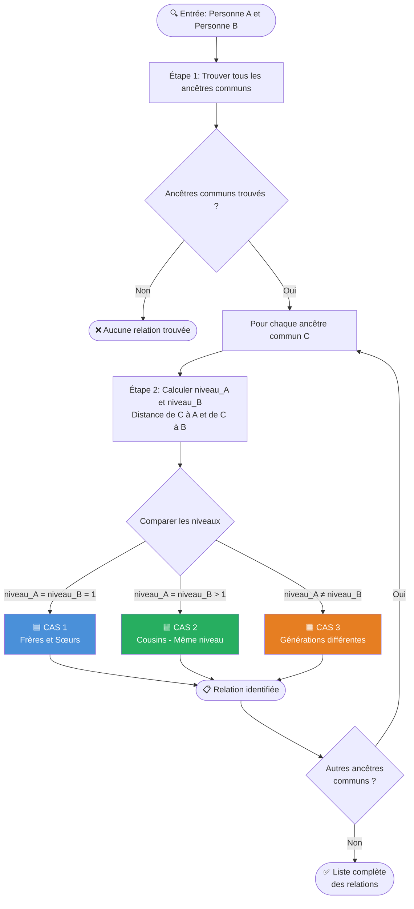

---

## 2. Concepts de Base

### 2.1 Structure de l'Arbre Généalogique

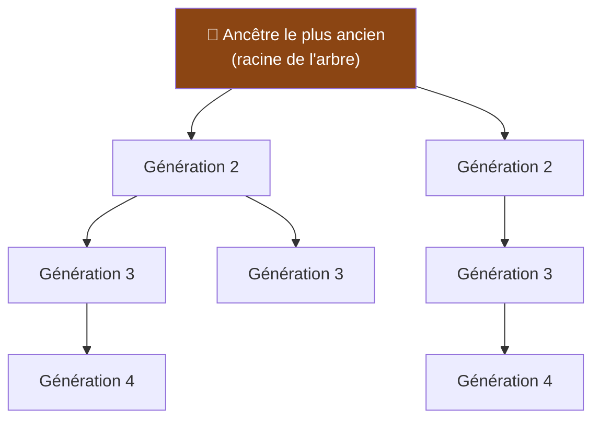

### 2.2 Définitions

| Terme | Définition |
|-------|-----------|
| **Ancêtre commun (C)** | Un noeud de l'arbre dont descendent à la fois A et B |
| **Niveau (distance)** | Nombre de liens parent→enfant entre C et une personne |
| **Noeud branche** | Premier descendant de C sur le chemin vers A ou B |
| **PA / PB** | Noeud branche de C vers A / vers B (enfant direct de C sur chaque branche) |

---

## 3. Étape 1 — Trouver les Ancêtres Communs

### Algorithme

```
Fonction TrouverAncêtresCommuns(A, B):
    ancêtres_A = TousLesAncêtres(A)    // remonter tous les parents
    ancêtres_B = TousLesAncêtres(B)    // remonter tous les parents
    communs = ancêtres_A ∩ ancêtres_B   // intersection
    Retourner communs
```

### Schéma : Ancêtres communs de A et B

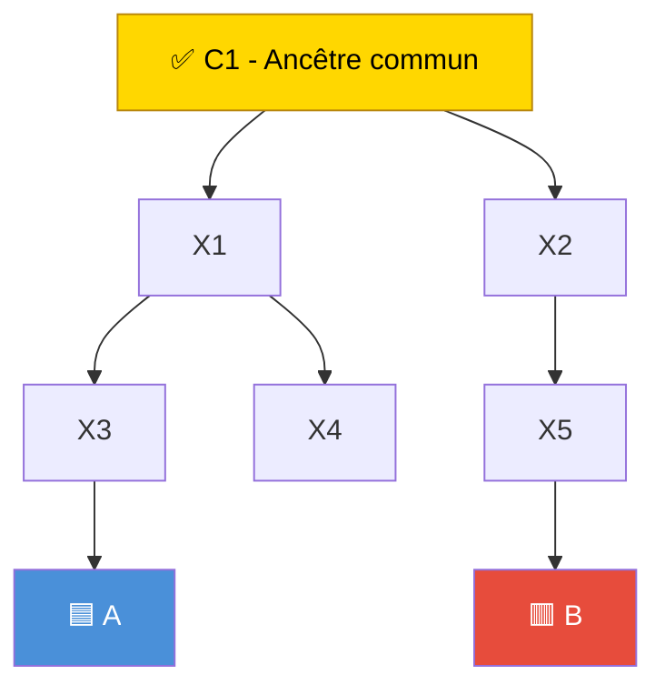

> **C1** est un ancêtre commun car A et B en descendent tous les deux.

---

## 4. Étape 2 — Calculer les Niveaux

Pour chaque ancêtre commun **C**, on calcule :

- **niveau_A** = distance de C à A (nombre de générations)
- **niveau_B** = distance de C à B (nombre de générations)
- **PA** = enfant direct de C sur le chemin vers A
- **PB** = enfant direct de C sur le chemin vers B

---

## 5. 🟦 CAS 1 — Frères et Sœurs (niveau_A = niveau_B = 1)

> L'ancêtre commun C est le **parent direct** de A et B.

### Schéma structurel

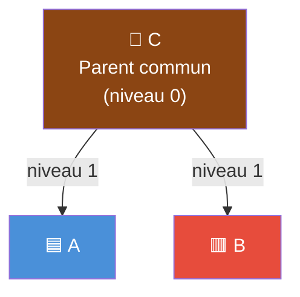

### Arbre de décision

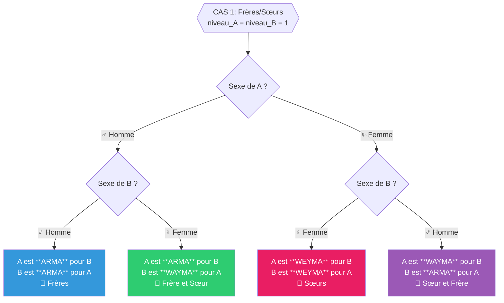

### Tableau récapitulatif — Frères et Sœurs

| Sexe A | Sexe B | A est ... pour B | B est ... pour A | Relation |
|--------|--------|------------------|------------------|----------|
| ♂ | ♂ | **ARMA** | **ARMA** | Frères |
| ♂ | ♀ | **ARMA** | **WAYMA** | Frère / Sœur |
| ♀ | ♂ | **WAYMA** | **ARMA** | Sœur / Frère |
| ♀ | ♀ | **WEYMA** | **WEYMA** | Sœurs |

> **ARMA** = frère (terme masculin)
> **WAYMA** = sœur (du point de vue d'un homme)
> **WEYMA** = sœur (entre femmes)

### 5.2 Sous-cas : Demi-frères / Demi-sœurs — BABA FO IZAYES

> Quand A et B ont le **même père mais des mères différentes**,
> on dit qu'ils sont **BABA FO IZAYES** (enfants d'un même père).

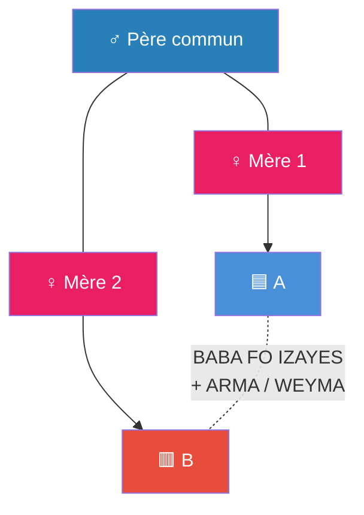

#### Tableau — Demi-frères/sœurs (BABA FO IZAYES)

| Sexe A | Sexe B | Terme de lien | + Terme d'appel |
|--------|--------|---------------|-----------------|
| ♂ | ♂ | **BABA FO IZAYES** | + **ARMA** ↔ **ARMA** |
| ♂ | ♀ | **BABA FO IZAYES** | + **ARMA** ↔ **WAYMA** |
| ♀ | ♂ | **BABA FO IZAYES** | + **WAYMA** ↔ **ARMA** |
| ♀ | ♀ | **BABA FO IZAYES** | + **WEYMA** ↔ **WEYMA** |

> 💡 **Double terme** : On utilise **BABA FO IZAYES** pour décrire le lien
> (même père, mères différentes), **ET** les termes **ARMA / WEYMA** comme
> appellation entre eux — les deux termes coexistent.

---

## 6. 🟩 CAS 2 — Cousins de Même Niveau (niveau_A = niveau_B > 1)

> A et B sont à la **même distance** de l'ancêtre commun C,
> mais passent par des **branches différentes**.

### Schéma structurel

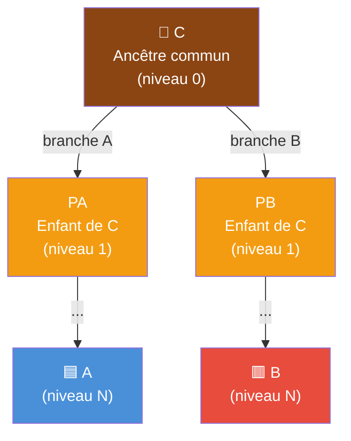

> **PA** et **PB** sont les enfants directs de C sur chaque branche.
> Leur **sexe** détermine le type de cousinage.

### Arbre de décision

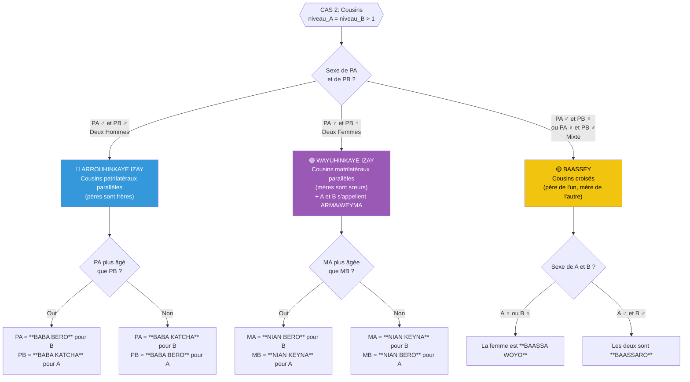

### Tableau récapitulatif — Cousins

| Sexe PA | Sexe PB | Type de Cousinage | Terme | Signification |
|---------|---------|-------------------|-------|---------------|
| ♂ | ♂ | **ARROUHINKAYE IZAY** | Cousins parallèles patrilatéraux | "Enfants de deux hommes" |
| ♀ | ♀ | **WAYUHINKAYE IZAY** | Cousins parallèles matrilatéraux | "Enfants de deux femmes" + **ARMA/WEYMA** selon sexe |
| ♂ | ♀ | **BAASSEY** | Cousins croisés | Père de l'un = frère de la mère de l'autre |
| ♀ | ♂ | **BAASSEY** | Cousins croisés | Mère de l'un = sœur du père de l'autre |

### Sous-termes des cousins

| Condition | Terme pour A↔B | Explication |
|-----------|---------------|-------------|
| ARROUHINKAYE + PA plus âgé | PA = **BABA BERO** pour B | "Grand-père" (frère aîné du père) |
| ARROUHINKAYE + PA plus jeune | PA = **BABA KATCHA** pour B | "Petit père" (frère cadet du père) |
| WAYUHINKAYE + MA plus âgée | MA = **NIAN BERO** pour B | "Grande mère" (sœur aînée de la mère) |
| WAYUHINKAYE + MA plus jeune | MA = **NIAN KEYNA** pour B | "Petite mère" (sœur cadette de la mère) |
| WAYUHINKAYE + A est femme | A = **WEYMA** pour B | En plus du lien WAYUHINKAYE |
| WAYUHINKAYE + A est homme | A = **ARMA** pour B | En plus du lien WAYUHINKAYE |
| BAASSEY + personne femme | **BAASSA WOYO** | Cousine croisée (femme) |
| BAASSEY + personne homme | **BAASSARO** | Cousin croisé (homme) |

### Schéma détaillé : ARROUHINKAYE IZAY

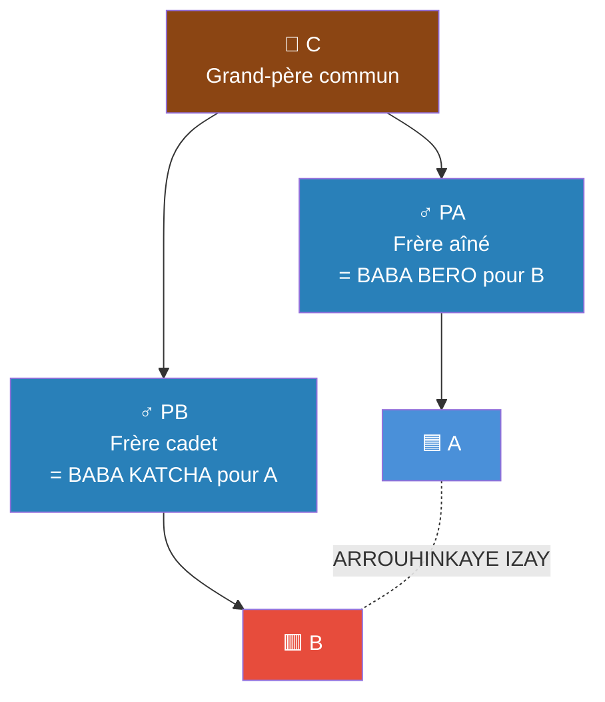

### Schéma détaillé : BAASSEY

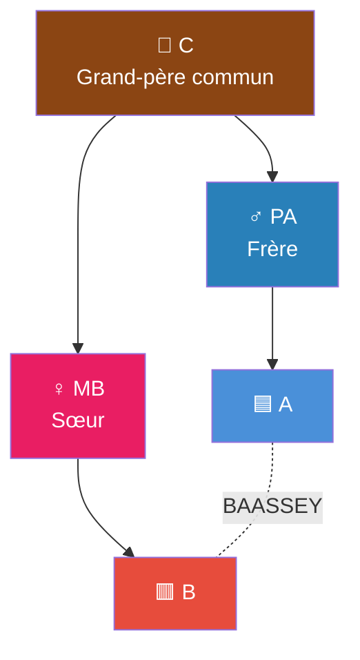

---

## 7. 🟧 CAS 3 — Générations Différentes (niveau_A ≠ niveau_B)

> A est **plus proche** de l'ancêtre commun que B.
> A est donc d'une **génération supérieure** à B.

On normalise : si niveau_A > niveau_B, on échange A et B
pour que **niveau_A ≤ niveau_B** toujours.

On note :
- **diff** = niveau_B − niveau_A (différence de générations)
- **NB** = le noeud sur la branche de B qui est **au même niveau** que A

### 7.1 Sous-cas : diff = 1 (Oncle / Tante ↔ Neveu / Nièce)

> A est au **même niveau** que le parent de B sur la branche commune.

#### Schéma structurel

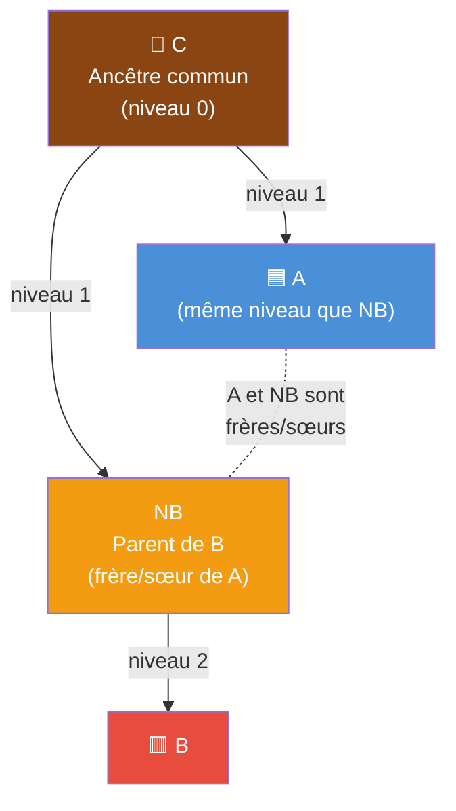

#### Arbre de décision (diff = 1)

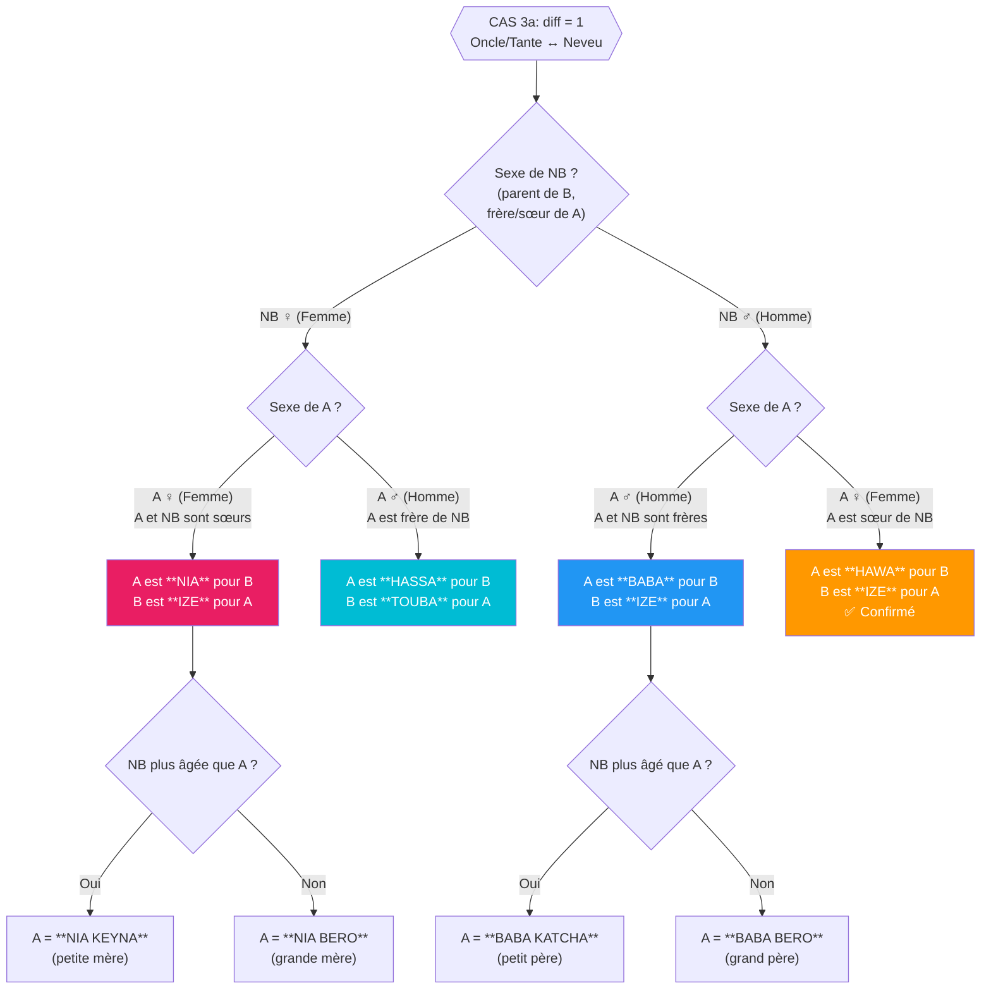

#### Tableau récapitulatif — Oncle/Tante (diff = 1)

| Sexe A | Sexe NB | A est ... pour B | B est ... pour A | Contexte |
|--------|---------|------------------|------------------|----------|
| ♀ | ♀ | **NIA BERO** ou **NIA KEYNA** | **IZE** | Sœurs → A = mère pour B |
| ♂ | ♀ | **HASSA** | **TOUBA** | Frère de la mère de B |
| ♂ | ♂ | **BABA BERO** ou **BABA KATCHA** | **IZE** | Frères → A = père pour B |
| ♀ | ♂ | **HAWA** ✅ | **IZE** | Sœur du père de B |

> ⚠️ Le terme pour la **tante paternelle** (sœur du père) reste à **confirmer avec les anciens**.

#### Détail des termes BERO / KEYNA / KATCHA

La précision **BERO** (aîné) ou **KEYNA/KATCHA** (cadet) dépend de l'**âge de A par rapport à NB** :

| Condition | Suffixe | Signification |
|-----------|---------|---------------|
| A **plus âgé(e)** que NB | **BERO** | "Grand/Grande" (aîné) |
| A **plus jeune** que NB | **KEYNA** / **KATCHA** | "Petit/Petite" (cadet) |

### 7.2 Sous-cas : diff ≥ 2 (Grand-parent ↔ Petit-enfant)

> A est à au moins **2 générations au-dessus** de B.
> Le terme Songhoy utilise **KAAGA** (♂) ou **KAAGA WOY** (♀) avec un suffixe selon le niveau.

#### Terminologie KAAGA par niveau

| Niveau | diff | Homme (♂) | Femme (♀) | Équivalent français |
|:------:|:----:|:----------|:----------|:--------------------|
| 1 | 2 | **KAAGA** | **KAAGA WOY** | Grand-père / Grand-mère |
| 2 | 3 | **KAAGA BERI DJINA** | **KAAGA WOY BERI DJINA** | Arrière-grand-père/mère |
| 3 | 4 | **KAAGA BERI HINKATO** | **KAAGA WOY BERI HINKATO** | 3ème niveau d'ancêtre |
| 4 | 5 | **KAAGA BERI HINZANTO** | **KAAGA WOY BERI HINZANTO** | 4ème niveau d'ancêtre |
| 5 | 6 | **KAAGA BERI TAATCHANTO** | **KAAGA WOY BERI TAATCHANTO** | 5ème niveau d'ancêtre |
| 6 | 7 | **KAAGA BERI GOUWANTO** | **KAAGA WOY BERI GOUWANTO** | 6ème niveau d'ancêtre |
| ≥7 | ≥8 | **KAAGA BERI** + N | **KAAGA WOY BERI** + N | Au-delà (N = numéro) |

> Le terme réciproque est toujours **HAAMA** (petit-enfant / descendant).

#### Schéma structurel — Niveaux de KAAGA

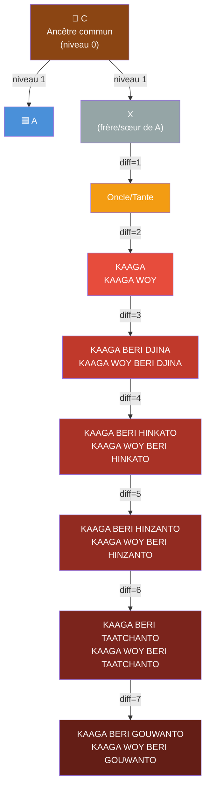

#### Arbre de décision (diff ≥ 2)

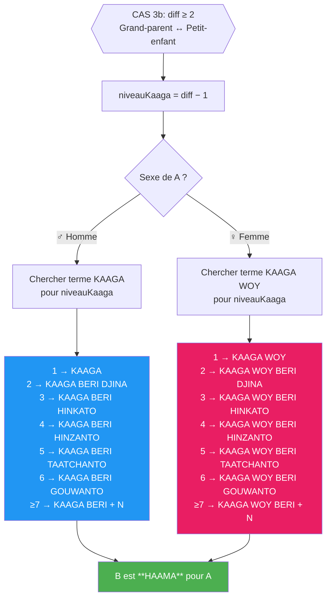

#### Tableau récapitulatif — Grand-parent (diff ≥ 2)

| Sexe A | diff | Niveau | A est ... pour B | B est ... pour A |
|--------|------|--------|------------------|------------------|
| ♂ | 2 | 1 | **KAAGA** | **HAAMA** |
| ♂ | 3 | 2 | **KAAGA BERI DJINA** | **HAAMA** |
| ♂ | 4 | 3 | **KAAGA BERI HINKATO** | **HAAMA** |
| ♂ | 5 | 4 | **KAAGA BERI HINZANTO** | **HAAMA** |
| ♂ | 6 | 5 | **KAAGA BERI TAATCHANTO** | **HAAMA** |
| ♂ | 7 | 6 | **KAAGA BERI GOUWANTO** | **HAAMA** |
| ♂ | ≥8 | ≥7 | **KAAGA BERI** + N | **HAAMA** |
| ♀ | 2 | 1 | **KAAGA WOY** | **HAAMA** |
| ♀ | 3 | 2 | **KAAGA WOY BERI DJINA** | **HAAMA** |
| ♀ | 4 | 3 | **KAAGA WOY BERI HINKATO** | **HAAMA** |
| ♀ | 5 | 4 | **KAAGA WOY BERI HINZANTO** | **HAAMA** |
| ♀ | 6 | 5 | **KAAGA WOY BERI TAATCHANTO** | **HAAMA** |
| ♀ | 7 | 6 | **KAAGA WOY BERI GOUWANTO** | **HAAMA** |
| ♀ | ≥8 | ≥7 | **KAAGA WOY BERI** + N | **HAAMA** |

> **KAAGA** = grand-père / ancêtre
> **KAAGA WOY** = grand-mère / ancêtre femme
> **BERI** = grand / supérieur
> **DJINA** = premier (niveau 2)
> **HINKATO** = deuxième (niveau 3)
> **HINZANTO** = troisième (niveau 4)
> **TAATCHANTO** = quatrième (niveau 5)
> **GOUWANTO** = cinquième (niveau 6)
> **HAAMA** = petit-enfant / descendant

---

## 8. Schéma de Décision Global

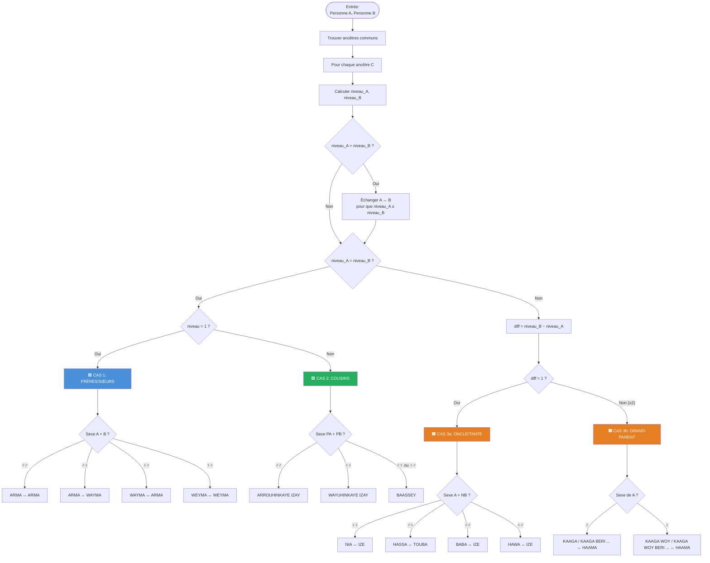

---

## 9. Pseudocode Complet

```
╔══════════════════════════════════════════════════════════════════╗
║  ALGORITHME: DéterminerRelationSonghoy(A, B)                    ║
╚══════════════════════════════════════════════════════════════════╝

FONCTION DéterminerRelationSonghoy(A, B):

    // ─── ÉTAPE 1: Trouver les ancêtres communs ───
    ancêtres_A ← TousLesAncêtres(A)
    ancêtres_B ← TousLesAncêtres(B)
    ancêtres_communs ← ancêtres_A ∩ ancêtres_B

    SI ancêtres_communs EST VIDE:
        Retourner "Aucune relation trouvée"

    relations ← []

    // ─── ÉTAPE 2: Pour chaque ancêtre commun ───
    POUR CHAQUE C DANS ancêtres_communs:

        niveau_A ← DistanceDans Arbre(C, A)
        niveau_B ← DistanceDansArbre(C, B)
        PA ← EnfantDirectDe(C, versA)   // enfant de C sur branche A
        PB ← EnfantDirectDe(C, versB)   // enfant de C sur branche B

        // Normaliser: A est toujours le plus proche de C
        SI niveau_A > niveau_B:
            Échanger(A, B)
            Échanger(niveau_A, niveau_B)
            Échanger(PA, PB)

        diff ← niveau_B − niveau_A

        // ═══════════════════════════════════════════════
        // CAS 1: FRÈRES ET SŒURS (même parent)
        // ═══════════════════════════════════════════════
        SI niveau_A = 1 ET niveau_B = 1:

            // Vérifier si demi-frères/sœurs (même père, mères différentes)
            SI père(A) = père(B) ET mère(A) ≠ mère(B):
                demi ← "BABA FO IZAYES"
            SINON:
                demi ← ""

            SI sexe(A) = ♂ ET sexe(B) = ♂:
                Ajouter(relations, demi + " A=ARMA pour B, B=ARMA pour A")
            SINON SI sexe(A) = ♂ ET sexe(B) = ♀:
                Ajouter(relations, demi + " A=ARMA pour B, B=WAYMA pour A")
            SINON SI sexe(A) = ♀ ET sexe(B) = ♂:
                Ajouter(relations, demi + " A=WAYMA pour B, B=ARMA pour A")
            SINON:  // ♀ et ♀
                Ajouter(relations, demi + " A=WEYMA pour B, B=WEYMA pour A")

        // ═══════════════════════════════════════════════
        // CAS 2: COUSINS (même niveau > 1)
        // ═══════════════════════════════════════════════
        SINON SI niveau_A = niveau_B:
            SI sexe(PA) = ♂ ET sexe(PB) = ♂:
                // ── ARROUHINKAYE IZAY ──
                type ← "ARROUHINKAYE IZAY"
                SI âge(PA) > âge(PB):
                    Ajouter(relations,
                        type + ": PA=BABA BERO pour B, PB=BABA KATCHA pour A")
                SINON:
                    Ajouter(relations,
                        type + ": PA=BABA KATCHA pour B, PB=BABA BERO pour A")

            SINON SI sexe(PA) = ♀ ET sexe(PB) = ♀:
                // ── WAYUHINKAYE IZAY ──
                type ← "WAYUHINKAYE IZAY"
                SI âge(PA) > âge(PB):
                    Ajouter(relations,
                        type + ": MA=NIAN BERO pour B, MB=NIAN KEYNA pour A")
                SINON:
                    Ajouter(relations,
                        type + ": MA=NIAN KEYNA pour B, MB=NIAN BERO pour A")
                // En plus, A et B s'appellent ARMA ou WEYMA selon le sexe
                SI sexe(A) = ♀:
                    Ajouter(relations, "A=WEYMA pour B")
                SINON:
                    Ajouter(relations, "A=ARMA pour B")
                SI sexe(B) = ♀:
                    Ajouter(relations, "B=WEYMA pour A")
                SINON:
                    Ajouter(relations, "B=ARMA pour A")

            SINON:
                // ── BAASSEY (cousins croisés) ──
                SI sexe(A) = ♀:
                    Ajouter(relations, "A=BAASSA WOYO")
                SINON:
                    Ajouter(relations, "A=BAASSARO")
                SI sexe(B) = ♀:
                    Ajouter(relations, "B=BAASSA WOYO")
                SINON:
                    Ajouter(relations, "B=BAASSARO")

        // ═══════════════════════════════════════════════
        // CAS 3: GÉNÉRATIONS DIFFÉRENTES
        // ═══════════════════════════════════════════════
        SINON:
            NB ← NoeudSurBranche(C, B, auNiveau=niveau_A)

            // ── CAS 3a: diff = 1 (Oncle/Tante) ──
            SI diff = 1:

                SI sexe(A) = ♀ ET sexe(NB) = ♀:
                    // A et NB sont sœurs → A = mère pour B
                    SI âge(NB) > âge(A):
                        Ajouter(relations, "A=NIA KEYNA pour B, B=IZE pour A")
                    SINON:
                        Ajouter(relations, "A=NIA BERO pour B, B=IZE pour A")

                SINON SI sexe(A) = ♂ ET sexe(NB) = ♀:
                    // A = frère de la mère de B
                    Ajouter(relations, "A=HASSA pour B, B=TOUBA pour A")

                SINON SI sexe(A) = ♂ ET sexe(NB) = ♂:
                    // A et NB sont frères → A = père pour B
                    SI âge(NB) > âge(A):
                        Ajouter(relations, "A=BABA KATCHA pour B, B=IZE pour A")
                    SINON:
                        Ajouter(relations, "A=BABA BERO pour B, B=IZE pour A")

                SINON:  // A ♀, NB ♂
                    // A = sœur du père de B (tante paternelle)
                    Ajouter(relations, "A=HAWA pour B, B=IZE pour A")

            // ── CAS 3b: diff ≥ 2 (Grand-parent avec niveaux KAAGA) ──
            SINON:
                niveauKaaga ← diff − 1
                termeKaaga ← ChercherTermeKaaga(sexe(A), niveauKaaga)
                // Lookup dans table de référence :
                //   Niveau 1 → KAAGA / KAAGA WOY
                //   Niveau 2 → KAAGA BERI DJINA / KAAGA WOY BERI DJINA
                //   Niveau 3 → KAAGA BERI HINKATO / KAAGA WOY BERI HINKATO
                //   Niveau 4 → KAAGA BERI HINZANTO / KAAGA WOY BERI HINZANTO
                //   Niveau 5 → KAAGA BERI TAATCHANTO / KAAGA WOY BERI TAATCHANTO
                //   Niveau 6 → KAAGA BERI GOUWANTO / KAAGA WOY BERI GOUWANTO
                //   Niveau ≥7 → KAAGA BERI + N / KAAGA WOY BERI + N
                Ajouter(relations,
                    "A=" + termeKaaga + " pour B, B=HAAMA pour A")

    Retourner relations
```

---

## 10. Dictionnaire Complet des Termes

### Termes de fratrie

| Terme Songhoy | Signification | Qui l'utilise ? |
|:--------------|:-------------|:----------------|
| **ARMA** | Frère | Utilisé par homme ou femme |
| **WAYMA** | Sœur | Utilisé par un homme envers sa sœur |
| **WEYMA** | Sœur | Utilisé entre femmes (sœurs) |
| **BABA FO IZAYES** | Demi-frères/sœurs (même père) | Même père, mères différentes |

> 💡 **BABA FO IZAYES** : Ce terme décrit le **lien** (même père, mères différentes).
> Les personnes s'appellent aussi **ARMA / WEYMA** entre elles — les deux termes coexistent.

### Termes de cousinage

| Terme Songhoy | Signification | Condition |
|:--------------|:-------------|:----------|
| **ARROUHINKAYE IZAY** | Cousins parallèles patrilatéraux | Pères sont frères |
| **WAYUHINKAYE IZAY** | Cousins parallèles matrilatéraux | Mères sont sœurs + s'appellent **ARMA/WEYMA** |
| **BAASSEY** | Cousins croisés | Un père et une mère sont frère/sœur |
| **BAASSARO** | Cousin croisé (homme) | Homme en relation BAASSEY |
| **BAASSA WOYO** | Cousine croisée (femme) | Femme en relation BAASSEY |

### Termes d'oncle / tante

| Terme Songhoy | Signification | Condition |
|:--------------|:-------------|:----------|
| **BABA BERO** | Grand-père / Oncle paternel aîné | Frère aîné du père |
| **BABA KATCHA** | Petit père / Oncle paternel cadet | Frère cadet du père |
| **NIAN BERO** | Grande mère / Tante maternelle aînée | Sœur aînée de la mère |
| **NIAN KEYNA** | Petite mère / Tante maternelle cadette | Sœur cadette de la mère |
| **HASSA** | Oncle maternel | Frère de la mère |
| **HAWA** | Tante paternelle ✅ | Sœur du père |

### Termes de neveu / nièce

| Terme Songhoy | Signification | Condition |
|:--------------|:-------------|:----------|
| **IZE** | Enfant / Neveu / Nièce | Terme générique (fils/fille du frère/sœur) |
| **TOUBA** | Neveu / Nièce (du HASSA) | Enfant de la sœur (pour un homme) |

### Termes de grand-parent / petit-enfant

| Terme Songhoy | Signification | Condition |
|:--------------|:-------------|:----------|
| **KAAGA** | Grand-père (niveau 1) | Homme, diff = 2 |
| **KAAGA WOY** | Grand-mère (niveau 1) | Femme, diff = 2 |
| **KAAGA BERI DJINA** | Ancêtre homme niveau 2 | Homme, diff = 3 |
| **KAAGA WOY BERI DJINA** | Ancêtre femme niveau 2 | Femme, diff = 3 |
| **KAAGA BERI HINKATO** | Ancêtre homme niveau 3 | Homme, diff = 4 |
| **KAAGA WOY BERI HINKATO** | Ancêtre femme niveau 3 | Femme, diff = 4 |
| **KAAGA BERI HINZANTO** | Ancêtre homme niveau 4 | Homme, diff = 5 |
| **KAAGA WOY BERI HINZANTO** | Ancêtre femme niveau 4 | Femme, diff = 5 |
| **KAAGA BERI TAATCHANTO** | Ancêtre homme niveau 5 | Homme, diff = 6 |
| **KAAGA WOY BERI TAATCHANTO** | Ancêtre femme niveau 5 | Femme, diff = 6 |
| **KAAGA BERI GOUWANTO** | Ancêtre homme niveau 6 | Homme, diff = 7 |
| **KAAGA WOY BERI GOUWANTO** | Ancêtre femme niveau 6 | Femme, diff = 7 |
| **KAAGA BERI** + N | Ancêtre homme niveau ≥7 | Homme, diff ≥ 8 |
| **KAAGA WOY BERI** + N | Ancêtre femme niveau ≥7 | Femme, diff ≥ 8 |
| **HAAMA** | Petit-enfant / Descendant | Quel que soit le niveau |

> 💡 **BERI** = grand/supérieur. Les suffixes comptent les niveaux au-delà du premier KAAGA :
> DJINA (1er), HINKATO (2ème), HINZANTO (3ème), TAATCHANTO (4ème), GOUWANTO (5ème).

---

## 11. Exemples Concrets

### Exemple 1 : Cousins ARROUHINKAYE

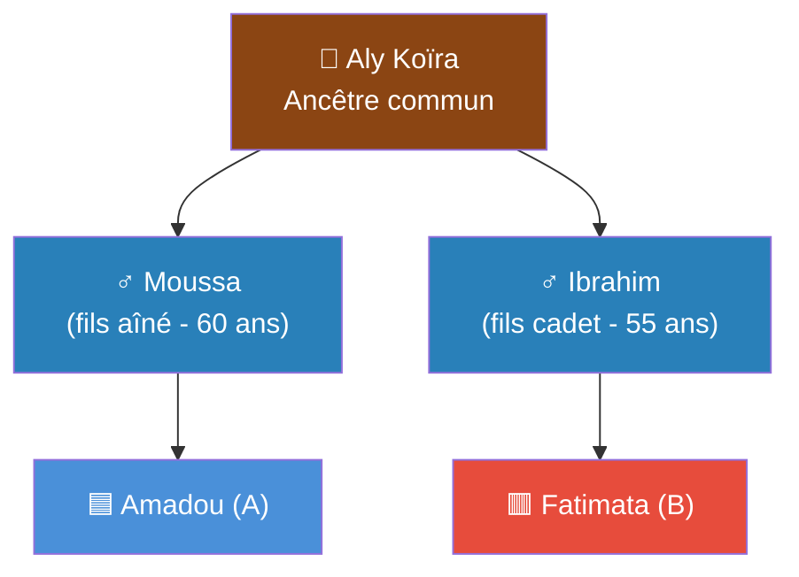

**Analyse :**
- Ancêtre commun : **Aly Koïra**
- niveau_A = 2, niveau_B = 2 → **Même niveau** → CAS 2
- PA = Moussa (♂), PB = Ibrahim (♂) → **Deux hommes**
- → **ARROUHINKAYE IZAY**
- Moussa (60 ans) > Ibrahim (55 ans)
- → Moussa = **BABA BERO** pour Fatimata
- → Ibrahim = **BABA KATCHA** pour Amadou

### Exemple 2 : Relation HASSA / TOUBA

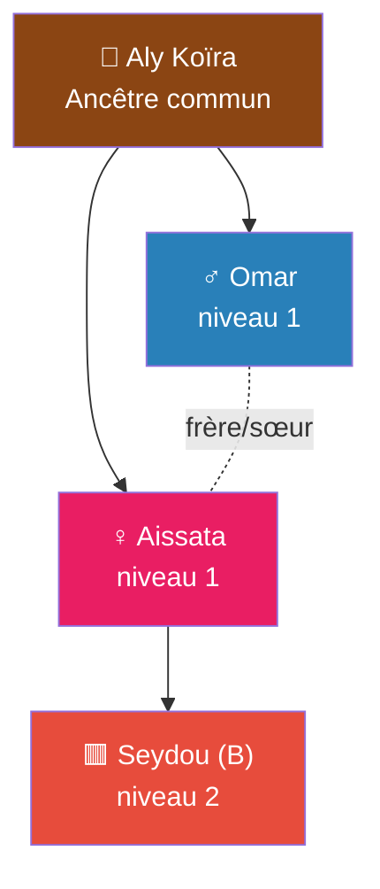

**Analyse :**
- A = **Omar**, B = **Seydou**
- Ancêtre commun : **Aly Koïra**
- niveau_A = 1, niveau_B = 2 → **CAS 3** (diff = 1)
- NB = Aissata (♀), A = Omar (♂)
- → sexe(A) = ♂, sexe(NB) = ♀
- → Omar est **HASSA** pour Seydou
- → Seydou est **TOUBA** pour Omar

### Exemple 3 : Sœurs (WEYMA)

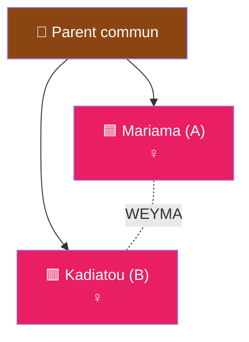

**Analyse :**
- niveau_A = 1, niveau_B = 1 → **CAS 1** (frères/sœurs)
- sexe(A) = ♀, sexe(B) = ♀
- → Mariama est **WEYMA** pour Kadiatou
- → Kadiatou est **WEYMA** pour Mariama

---

## 12. Points à Confirmer avec les Anciens 🔍

| # | Question | Terme | Statut |
|---|----------|-------|--------|
| 1 | Sœur du père (tante paternelle) → quel terme exact ? | **HAWA** | ✅ Confirmé |
| 2 | Si A ♀ et NB ♂ (diff=1), B appelle A comment ? | **IZE** | ✅ Confirmé |
| 3 | Cousin dont les mères sont sœurs, terme local à Gao ? | **WAYUHINKAYE IZAY** + ARMA/WEYMA | ✅ Confirmé |
| 4 | Pour diff ≥ 3 (arrière-grand-parent), même terme KAAGA ? | **KAAGA BERI** + suffixes par niveau | ✅ Confirmé |
| 5 | Frère/sœur de même père mais mère différente ? | **BABA FO IZAYES** + ARMA/WEYMA | ✅ Confirmé |
| 6 | Termes pour les relations par alliance (beau-frère, etc.) | — | ⚠️ À ajouter |

---

## 13. Résumé Visuel — Carte des Relations

```
                        ┌─────────────────────────────────┐
                        │     ANCÊTRE COMMUN (C)          │
                        └──────────┬──────────────────────┘
                                   │
                    ┌──────────────┼──────────────┐
                    │              │              │
              ┌─────┴─────┐ ┌─────┴─────┐ ┌─────┴─────┐
              │   PA (♂)  │ │   PA (♀)  │ │ PA♂/PB♀   │
              │   PB (♂)  │ │   PB (♀)  │ │ ou inverse │
              └─────┬─────┘ └─────┬─────┘ └─────┬─────┘
                    │              │              │
                    ▼              ▼              ▼
             ARROUHINKAYE    WAYUHINKAYE      BAASSEY
                IZAY            IZAY          ┌────┴────┐
             (Pères sont     (Mères sont      │         │
              frères)        sœurs)        BAASSARO  BAASSA
                           + ARMA/WEYMA     (♂)     WOYO (♀)

   ═══════════════════════════════════════════════════════

     RELATIONS VERTICALES (générations différentes)
     ──────────────────────────────────────────────

     diff=1     ♂+♂ → BABA (BERO/KATCHA) ↔ IZE
                ♀+♀ → NIA (BERO/KEYNA)   ↔ IZE
                ♂+♀ → HASSA              ↔ TOUBA
                ♀+♂ → HAWA               ↔ IZE

     diff=2     ♂ → KAAGA              ♀ → KAAGA WOY              ↔ HAAMA
     diff=3     ♂ → KAAGA BERI DJINA   ♀ → KAAGA WOY BERI DJINA   ↔ HAAMA
     diff=4     ♂ → KAAGA BERI HINKATO ♀ → KAAGA WOY BERI HINKATO ↔ HAAMA
     diff=5     ♂ → KAAGA BERI HINZANTO   ...WOY BERI HINZANTO    ↔ HAAMA
     diff=6     ♂ → KAAGA BERI TAATCHANTO ...WOY BERI TAATCHANTO   ↔ HAAMA
     diff=7     ♂ → KAAGA BERI GOUWANTO   ...WOY BERI GOUWANTO    ↔ HAAMA
     diff≥8     ♂ → KAAGA BERI + N        ...WOY BERI + N         ↔ HAAMA

   ═══════════════════════════════════════════════════════

     FRATRIE (même parent direct)
     ────────────────────────────

                ♂↔♂  → ARMA    ↔ ARMA
                ♂↔♀  → ARMA    ↔ WAYMA
                ♀↔♀  → WEYMA   ↔ WEYMA

     DEMI-FRATRIE (même père, mères différentes)
     ────────────────────────────────────────────

                BABA FO IZAYES + ARMA / WEYMA
```

---

*Document créé pour l'application généalogique de la famille Aly Koïra*
*Gao, Mali — Février 2025*
