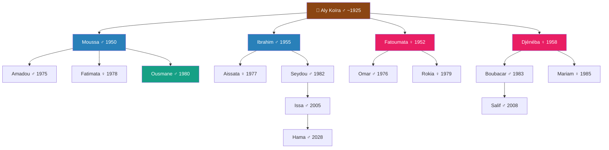

# 🧪 Exemples de Vérification — Algorithme Relations Songhoy

## Famille Aly Koïra — Gao, Mali

---

## 1. Arbre Généalogique de Test

### 1.1 Structure complète (25 personnes, 5 générations)

```
Génération 0 :
  Aly Koïra (♂, ~1925) ── Hawa Maïga (♀, ~1928)

Génération 1 (enfants d'Aly + Hawa) :
  ├── Moussa     (♂, 1950) — fils aîné
  ├── Fatoumata  (♀, 1952)
  ├── Ibrahim    (♂, 1955)
  └── Djénéba    (♀, 1958) — fille cadette

Génération 2 :
  Moussa ── épouse 1 : Aminata (♀)
    ├── Amadou    (♂, 1975)
    └── Fatimata  (♀, 1978)
  Moussa ── épouse 2 : Fanta (♀)
    └── Ousmane   (♂, 1980)

  Ibrahim ── Mariama (♀)
    ├── Aissata   (♀, 1977)
    └── Seydou    (♂, 1982)

  Fatoumata ── Hamidou (♂, externe)
    ├── Omar      (♂, 1976)
    └── Rokia     (♀, 1979)

  Djénéba ── Abdoulaye (♂, externe)
    ├── Boubacar  (♂, 1983)
    └── Mariam    (♀, 1985)

Génération 3 :
  Seydou ── Kadiatou (♀)
    └── Issa      (♂, 2005)

  Boubacar ── Safiatou (♀)
    └── Salif     (♂, 2008)

Génération 4 :
  Issa ── Aïcha (♀)
    └── Hama      (♂, 2028)
```

### 1.2 Schéma visuel



### 1.3 Tableau des personnes

| ID | Nom | Sexe | Né(e) | Père | Mère | Gén. |
|:--:|:----|:----:|:-----:|:-----|:-----|:----:|
| 1 | Aly Koïra | ♂ | ~1925 | — | — | 0 |
| 2 | Hawa Maïga | ♀ | ~1928 | — | — | 0 |
| 3 | Moussa | ♂ | 1950 | Aly (1) | Hawa (2) | 1 |
| 4 | Fatoumata | ♀ | 1952 | Aly (1) | Hawa (2) | 1 |
| 5 | Ibrahim | ♂ | 1955 | Aly (1) | Hawa (2) | 1 |
| 6 | Djénéba | ♀ | 1958 | Aly (1) | Hawa (2) | 1 |
| 7 | Aminata | ♀ | — | — | — | ext. |
| 8 | Fanta | ♀ | — | — | — | ext. |
| 9 | Amadou | ♂ | 1975 | Moussa (3) | Aminata (7) | 2 |
| 10 | Fatimata | ♀ | 1978 | Moussa (3) | Aminata (7) | 2 |
| 11 | Ousmane | ♂ | 1980 | Moussa (3) | Fanta (8) | 2 |
| 12 | Aissata | ♀ | 1977 | Ibrahim (5) | Mariama | 2 |
| 13 | Seydou | ♂ | 1982 | Ibrahim (5) | Mariama | 2 |
| 14 | Omar | ♂ | 1976 | Hamidou | Fatoumata (4) | 2 |
| 15 | Rokia | ♀ | 1979 | Hamidou | Fatoumata (4) | 2 |
| 16 | Boubacar | ♂ | 1983 | Abdoulaye | Djénéba (6) | 2 |
| 17 | Mariam | ♀ | 1985 | Abdoulaye | Djénéba (6) | 2 |
| 18 | Issa | ♂ | 2005 | Seydou (13) | Kadiatou | 3 |
| 19 | Salif | ♂ | 2008 | Boubacar (16) | Safiatou | 3 |
| 20 | Hama | ♂ | 2028 | Issa (18) | Aïcha | 4 |

---

## 2. CAS 1 — Frères et Sœurs

---

### ✅ Exemple 1 : Amadou ♂ ↔ Fatimata ♀ — Frère et sœur

```
A = Amadou (♂, 1975)    B = Fatimata (♀, 1978)
Père commun : Moussa     Mère commune : Aminata
```

**Déroulé :**
1. Ancêtres communs : Moussa (3) et Aminata (7)
2. Pour C = Moussa (3) :
   - niveau_A (Moussa→Amadou) = **1**
   - niveau_B (Moussa→Fatimata) = **1**
   - branche_A = Amadou, branche_B = Fatimata → différentes ✓
   - diff = 0 → **CAS 1**
3. père(A) = Moussa = père(B) ✓, mère(A) = Aminata = mère(B) ✓ → **pas demi**
4. sexe(A) = ♂, sexe(B) = ♀

```
┌─────────────────────────────────────────────┐
│  RÉSULTAT :  Catégorie SIBLINGS             │
│  Amadou  est  ARMA   pour Fatimata          │
│  Fatimata est  WAYMA  pour Amadou           │
└─────────────────────────────────────────────┘
```

---

### ✅ Exemple 2 : Amadou ♂ ↔ Ousmane ♂ — Demi-frères (BABA FO IZAYES)

```
A = Amadou (♂, 1975)     B = Ousmane (♂, 1980)
Père commun : Moussa
Mère A : Aminata          Mère B : Fanta ← différentes !
```

**Déroulé :**
1. Ancêtres communs : Moussa (3) — seul commun (mères différentes)
2. Pour C = Moussa (3) :
   - niveau_A = **1**, niveau_B = **1**, diff = 0 → **CAS 1**
3. père(A) = Moussa = père(B) ✓
4. mère(A) = Aminata ≠ mère(B) = Fanta → **BABA FO IZAYES**
5. sexe(A) = ♂, sexe(B) = ♂

```
┌─────────────────────────────────────────────┐
│  RÉSULTAT :  Catégorie HALF_SIBLINGS        │
│  BABA FO IZAYES (même père, mères ≠)       │
│  Amadou  est  ARMA  pour Ousmane            │
│  Ousmane est  ARMA  pour Amadou             │
└─────────────────────────────────────────────┘
```

---

### ✅ Exemple 3 : Fatimata ♀ ↔ Ousmane ♂ — Demi-sœur et demi-frère

```
A = Fatimata (♀, 1978)   B = Ousmane (♂, 1980)
Père commun : Moussa
Mère A : Aminata          Mère B : Fanta ← différentes !
```

**Déroulé :**
1. C = Moussa → niveau_A = **1**, niveau_B = **1** → **CAS 1**
2. Même père, mères différentes → **BABA FO IZAYES**
3. sexe(A) = ♀, sexe(B) = ♂

```
┌─────────────────────────────────────────────┐
│  RÉSULTAT :  Catégorie HALF_SIBLINGS        │
│  BABA FO IZAYES                             │
│  Fatimata est  WAYMA  pour Ousmane          │
│  Ousmane  est  ARMA   pour Fatimata         │
└─────────────────────────────────────────────┘
```

---

## 3. CAS 2 — Cousins

---

### ✅ Exemple 4 : Amadou ♂ ↔ Seydou ♂ — ARROUHINKAYE IZAY (pères frères)

```
A = Amadou (♂, 1975)           B = Seydou (♂, 1982)
Père d'A : Moussa (♂, 1950)    Père de B : Ibrahim (♂, 1955)
Moussa et Ibrahim sont frères (enfants d'Aly)
```

**Déroulé :**
1. Ancêtre commun : **Aly (1)**
2. Chemin Aly→Amadou : Aly → **Moussa** → Amadou → niveau_A = **2**
3. Chemin Aly→Seydou : Aly → **Ibrahim** → Seydou → niveau_B = **2**
4. branche_A = **Moussa (♂)**, branche_B = **Ibrahim (♂)** → différentes ✓
5. diff = 0, niveau = 2 > 1 → **CAS 2**
6. sexe(branche_A) = ♂, sexe(branche_B) = ♂ → **les deux ♂ → ARROUHINKAYE IZAY**
7. Moussa (1950) né avant Ibrahim (1955) → **Moussa est l'aîné**

```
┌──────────────────────────────────────────────────────────────┐
│  RÉSULTAT :  Catégorie COUSINS_PATRI (ARROUHINKAYE IZAY)    │
│                                                              │
│  Moussa (père d'Amadou)    = BABA BERO  pour Seydou         │
│  Ibrahim (père de Seydou)  = BABA KATCHA pour Amadou        │
│                                                              │
│  → Seydou appelle Moussa "BABA BERO" (grand père)           │
│  → Amadou appelle Ibrahim "BABA KATCHA" (petit père)        │
└──────────────────────────────────────────────────────────────┘
```

---

### ✅ Exemple 5 : Amadou ♂ ↔ Omar ♂ — BAASSEY (cousins croisés)

```
A = Amadou (♂, 1975)            B = Omar (♂, 1976)
Père d'A : Moussa (♂, 1950)     Mère de B : Fatoumata (♀, 1952)
Moussa et Fatoumata sont frère et sœur (enfants d'Aly)
```

**Déroulé :**
1. Ancêtre commun : **Aly (1)**
2. Aly → **Moussa (♂)** → Amadou → niveau_A = **2**
3. Aly → **Fatoumata (♀)** → Omar → niveau_B = **2**
4. diff = 0, niveau = 2 > 1 → **CAS 2**
5. sexe(branche_A) = ♂, sexe(branche_B) = ♀ → **mixte → BAASSEY**
6. sexe(A) = ♂ → **BAASSARO**, sexe(B) = ♂ → **BAASSARO**

```
┌──────────────────────────────────────────────────────────────┐
│  RÉSULTAT :  Catégorie COUSINS_CROSS (BAASSEY)              │
│                                                              │
│  Amadou est  BAASSARO   (cousin croisé homme)               │
│  Omar   est  BAASSARO   (cousin croisé homme)               │
└──────────────────────────────────────────────────────────────┘
```

---

### ✅ Exemple 6 : Fatimata ♀ ↔ Rokia ♀ — BAASSEY (cousines croisées)

```
A = Fatimata (♀, 1978)          B = Rokia (♀, 1979)
branche_A = Moussa (♂)          branche_B = Fatoumata (♀)
```

**Déroulé :**
1. Même niveau = 2 → **CAS 2**
2. sexe(PA) = ♂, sexe(PB) = ♀ → **mixte → BAASSEY**
3. sexe(A) = ♀ → **BAASSA WOYO**, sexe(B) = ♀ → **BAASSA WOYO**

```
┌──────────────────────────────────────────────────────────────┐
│  RÉSULTAT :  Catégorie COUSINS_CROSS (BAASSEY)              │
│                                                              │
│  Fatimata est  BAASSA WOYO  (cousine croisée femme)         │
│  Rokia    est  BAASSA WOYO  (cousine croisée femme)         │
└──────────────────────────────────────────────────────────────┘
```

---

### ✅ Exemple 7 : Amadou ♂ ↔ Rokia ♀ — BAASSEY (homme ↔ femme croisés)

```
branche_A = Moussa (♂)          branche_B = Fatoumata (♀) → mixte
```

```
┌──────────────────────────────────────────────────────────────┐
│  RÉSULTAT :  Catégorie COUSINS_CROSS (BAASSEY)              │
│                                                              │
│  Amadou  est  BAASSARO      pour Rokia                      │
│  Rokia   est  BAASSA WOYO   pour Amadou                     │
└──────────────────────────────────────────────────────────────┘
```

---

### ✅ Exemple 8 : Omar ♂ ↔ Boubacar ♂ — WAYUHINKAYE IZAY (mères sœurs)

```
A = Omar (♂, 1976)               B = Boubacar (♂, 1983)
Mère d'A : Fatoumata (♀, 1952)   Mère de B : Djénéba (♀, 1958)
Fatoumata et Djénéba sont sœurs (filles d'Aly)
```

**Déroulé :**
1. Ancêtre commun : **Aly (1)**
2. Aly → **Fatoumata (♀)** → Omar → niveau_A = **2**
3. Aly → **Djénéba (♀)** → Boubacar → niveau_B = **2**
4. diff = 0, niveau = 2 > 1 → **CAS 2**
5. sexe(branche_A) = ♀, sexe(branche_B) = ♀ → **les deux ♀ → WAYUHINKAYE IZAY**
6. Fatoumata (1952) née avant Djénéba (1958) → **Fatoumata est l'aînée**
7. Termes additionnels : sexe(A) = ♂ → A = **ARMA**, sexe(B) = ♂ → B = **ARMA**

```
┌──────────────────────────────────────────────────────────────┐
│  RÉSULTAT :  Catégorie COUSINS_MATRI (WAYUHINKAYE IZAY)     │
│                                                              │
│  Fatoumata (mère d'Omar)    = NIAN BERO  pour Boubacar      │
│  Djénéba (mère de Boubacar) = NIAN KEYNA pour Omar          │
│                                                              │
│  + Omar     est  ARMA  pour Boubacar                        │
│  + Boubacar est  ARMA  pour Omar                            │
└──────────────────────────────────────────────────────────────┘
```

---

### ✅ Exemple 9 : Rokia ♀ ↔ Mariam ♀ — WAYUHINKAYE IZAY + WEYMA

```
A = Rokia (♀, 1979)              B = Mariam (♀, 1985)
branche_A = Fatoumata (♀, 1952)  branche_B = Djénéba (♀, 1958)
```

**Déroulé :**
1. Même niveau = 2 → **CAS 2**, PA♀ + PB♀ → **WAYUHINKAYE IZAY**
2. Fatoumata aînée → **NIAN BERO** pour Mariam / Djénéba → **NIAN KEYNA** pour Rokia
3. Termes additionnels : sexe(A) = ♀ → A = **WEYMA**, sexe(B) = ♀ → B = **WEYMA**

```
┌──────────────────────────────────────────────────────────────┐
│  RÉSULTAT :  Catégorie COUSINS_MATRI (WAYUHINKAYE IZAY)     │
│                                                              │
│  Fatoumata (mère de Rokia) = NIAN BERO  pour Mariam         │
│  Djénéba (mère de Mariam)  = NIAN KEYNA pour Rokia          │
│                                                              │
│  + Rokia   est  WEYMA  pour Mariam                          │
│  + Mariam  est  WEYMA  pour Rokia                           │
└──────────────────────────────────────────────────────────────┘
```

---

### ✅ Exemple 10 : Issa ♂ ↔ Salif ♂ — BAASSEY (profondeur 3)

```
A = Issa (♂, 2005)               B = Salif (♂, 2008)
Chemin : Aly → Ibrahim → Seydou → Issa      (niveau 3)
Chemin : Aly → Djénéba → Boubacar → Salif   (niveau 3)
```

**Déroulé :**
1. Ancêtre commun : **Aly (1)**
2. niveau_A = **3**, niveau_B = **3**, diff = 0 → **CAS 2**
3. branche_A = **Ibrahim (♂)**, branche_B = **Djénéba (♀)** → **mixte → BAASSEY**

> 💡 Le type de cousinage est déterminé par les **branches** (Ibrahim ♂ / Djénéba ♀),
> pas par les parents directs (Seydou / Boubacar).

```
┌──────────────────────────────────────────────────────────────┐
│  RÉSULTAT :  Catégorie COUSINS_CROSS (BAASSEY)              │
│                                                              │
│  Issa   est  BAASSARO  (cousin croisé homme)                │
│  Salif  est  BAASSARO  (cousin croisé homme)                │
└──────────────────────────────────────────────────────────────┘
```

---

### ✅ Exemple 11 : Cohérence multi-ancêtres (Issa ↔ Salif via Hawa Maïga)

> Même paire, mais via l'ancêtre commun **Hawa Maïga (2)** au lieu d'Aly.

1. Hawa → **Ibrahim (♂)** → Seydou → Issa → niveau_A = **3**
2. Hawa → **Djénéba (♀)** → Boubacar → Salif → niveau_B = **3**
3. branche_A = **Ibrahim (♂)**, branche_B = **Djénéba (♀)** → **BAASSEY**

> ✅ Même résultat via les deux ancêtres → l'algorithme est **cohérent**.
> L'implémentation devra **dédupliquer** les résultats identiques.

---

## 4. CAS 3a — Oncle/Tante (diff = 1)

---

### ✅ Exemple 12 : Moussa ♂ ↔ Seydou ♂ — BABA BERO (oncle paternel aîné)

```
A = Moussa (♂, 1950)             B = Seydou (♂, 1982)
Chemin : Aly → Moussa            (niveau 1)
Chemin : Aly → Ibrahim → Seydou  (niveau 2)
```

**Déroulé :**
1. Ancêtre commun : **Aly (1)**
2. niveau_A = **1**, niveau_B = **2**
3. Normalisation : 1 ≤ 2 → pas d'échange
4. diff = 2 − 1 = **1** → **CAS 3a**
5. NB = noeud sur branche de B au même niveau que A (niveau 1) = **Ibrahim (♂, 1955)**
6. sexe(A) = ♂ (Moussa), sexe(NB) = ♂ (Ibrahim) → **A♂ + NB♂ → BABA**
7. estPlusAgé(NB, A) : Ibrahim (1955) vs Moussa (1950) → Ibrahim **plus jeune** → false
8. → A est l'aîné → **BABA BERO**

```
┌──────────────────────────────────────────────────────────────┐
│  RÉSULTAT :  Catégorie UNCLE_AUNT                           │
│                                                              │
│  Moussa  est  BABA BERO  pour Seydou                        │
│    (grand père — frère aîné du père Ibrahim)                │
│  Seydou  est  IZE  pour Moussa                              │
└──────────────────────────────────────────────────────────────┘
```

---

### ✅ Exemple 13 : Ibrahim ♂ ↔ Amadou ♂ — BABA KATCHA (oncle paternel cadet)

```
A = Ibrahim (♂, 1955)            B = Amadou (♂, 1975)
Chemin : Aly → Ibrahim           (niveau 1)
Chemin : Aly → Moussa → Amadou   (niveau 2)
```

**Déroulé :**
1. niveau_A = **1**, niveau_B = **2**, diff = **1** → **CAS 3a**
2. NB = **Moussa (♂, 1950)** — noeud au niveau 1 sur branche de B
3. sexe(A) = ♂, sexe(NB) = ♂ → **BABA**
4. estPlusAgé(NB, A) : Moussa (1950) vs Ibrahim (1955) → Moussa **plus âgé** → true
5. → NB (le père de B) est l'aîné, donc A est le cadet → **BABA KATCHA**

```
┌──────────────────────────────────────────────────────────────┐
│  RÉSULTAT :  Catégorie UNCLE_AUNT                           │
│                                                              │
│  Ibrahim  est  BABA KATCHA  pour Amadou                     │
│    (petit père — frère cadet du père Moussa)                │
│  Amadou   est  IZE  pour Ibrahim                            │
└──────────────────────────────────────────────────────────────┘
```

---

### ✅ Exemple 14 : Moussa ♂ ↔ Omar ♂ — HASSA (oncle maternel)

```
A = Moussa (♂, 1950)              B = Omar (♂, 1976)
Chemin : Aly → Moussa             (niveau 1)
Chemin : Aly → Fatoumata → Omar   (niveau 2)
```

**Déroulé :**
1. diff = **1** → **CAS 3a**
2. NB = **Fatoumata (♀, 1952)** — la mère d'Omar
3. sexe(A) = ♂ (Moussa), sexe(NB) = ♀ (Fatoumata) → **A♂ + NB♀ → HASSA**

> 💡 Moussa est le frère de Fatoumata (la mère d'Omar).
> Oncle maternel = frère de la mère = **HASSA**.

```
┌──────────────────────────────────────────────────────────────┐
│  RÉSULTAT :  Catégorie UNCLE_AUNT                           │
│                                                              │
│  Moussa  est  HASSA  pour Omar                              │
│    (oncle maternel — frère de la mère Fatoumata)            │
│  Omar    est  TOUBA  pour Moussa                            │
└──────────────────────────────────────────────────────────────┘
```

---

### ✅ Exemple 15 : Fatoumata ♀ ↔ Seydou ♂ — HAWA (tante paternelle)

```
A = Fatoumata (♀, 1952)           B = Seydou (♂, 1982)
Chemin : Aly → Fatoumata          (niveau 1)
Chemin : Aly → Ibrahim → Seydou   (niveau 2)
```

**Déroulé :**
1. diff = **1** → **CAS 3a**
2. NB = **Ibrahim (♂, 1955)** — le père de Seydou
3. sexe(A) = ♀ (Fatoumata), sexe(NB) = ♂ (Ibrahim) → **A♀ + NB♂ → HAWA**

> 💡 Fatoumata est la sœur d'Ibrahim (le père de Seydou).
> Tante paternelle = sœur du père = **HAWA**.

```
┌──────────────────────────────────────────────────────────────┐
│  RÉSULTAT :  Catégorie UNCLE_AUNT                           │
│                                                              │
│  Fatoumata  est  HAWA  pour Seydou                          │
│    (tante paternelle — sœur du père Ibrahim)                │
│  Seydou     est  IZE   pour Fatoumata                       │
└──────────────────────────────────────────────────────────────┘
```

---

### ✅ Exemple 16 : Djénéba ♀ ↔ Omar ♂ — NIAN KEYNA (tante maternelle cadette)

```
A = Djénéba (♀, 1958)             B = Omar (♂, 1976)
Chemin : Aly → Djénéba            (niveau 1)
Chemin : Aly → Fatoumata → Omar   (niveau 2)
```

**Déroulé :**
1. diff = **1** → **CAS 3a**
2. NB = **Fatoumata (♀, 1952)** — la mère d'Omar
3. sexe(A) = ♀ (Djénéba), sexe(NB) = ♀ (Fatoumata) → **A♀ + NB♀ → NIA**
4. estPlusAgé(NB, A) : Fatoumata (1952) vs Djénéba (1958) → Fatoumata **plus âgée** → true
5. → NB (la mère de B) est plus âgée que A → A est la cadette → **NIAN KEYNA**

> 💡 Djénéba est la petite sœur de Fatoumata (mère d'Omar).
> Petite sœur de la mère = **NIAN KEYNA** (petite mère).

```
┌──────────────────────────────────────────────────────────────┐
│  RÉSULTAT :  Catégorie UNCLE_AUNT                           │
│                                                              │
│  Djénéba  est  NIAN KEYNA  pour Omar                        │
│    (petite mère — sœur cadette de la mère Fatoumata)       │
│  Omar     est  IZE  pour Djénéba                            │
└──────────────────────────────────────────────────────────────┘
```

---

### ✅ Exemple 17 : Fatoumata ♀ ↔ Boubacar ♂ — NIAN BERO (tante maternelle aînée)

```
A = Fatoumata (♀, 1952)              B = Boubacar (♂, 1983)
Chemin : Aly → Fatoumata             (niveau 1)
Chemin : Aly → Djénéba → Boubacar    (niveau 2)
```

**Déroulé :**
1. diff = **1** → **CAS 3a**
2. NB = **Djénéba (♀, 1958)** — la mère de Boubacar
3. sexe(A) = ♀, sexe(NB) = ♀ → **NIA**
4. estPlusAgé(NB, A) : Djénéba (1958) vs Fatoumata (1952) → Djénéba **plus jeune** → false
5. → A est l'aînée → **NIAN BERO**

```
┌──────────────────────────────────────────────────────────────┐
│  RÉSULTAT :  Catégorie UNCLE_AUNT                           │
│                                                              │
│  Fatoumata  est  NIAN BERO  pour Boubacar                   │
│    (grande mère — sœur aînée de la mère Djénéba)           │
│  Boubacar   est  IZE  pour Fatoumata                        │
└──────────────────────────────────────────────────────────────┘
```

---

### ✅ Exemple 18 : Amadou ♂ ↔ Issa ♂ — BABA BERO (niveaux 2 vs 3)

```
A = Amadou (♂, 1975)                        B = Issa (♂, 2005)
Chemin : Aly → Moussa → Amadou              (niveau 2)
Chemin : Aly → Ibrahim → Seydou → Issa      (niveau 3)
```

**Déroulé :**
1. Ancêtre commun : **Aly (1)**
2. niveau_A = **2**, niveau_B = **3**, normalisation OK
3. diff = 3 − 2 = **1** → **CAS 3a**
4. NB = noeud sur branche de B au même niveau que A (niveau 2) = **Seydou (♂, 1982)**
5. sexe(A) = ♂ (Amadou), sexe(NB) = ♂ (Seydou) → **BABA**
6. estPlusAgé(NB, A) : Seydou (1982) vs Amadou (1975) → Seydou **plus jeune** → false
7. → A est l'aîné → **BABA BERO**

> 💡 Amadou et Seydou sont cousins (ARROUHINKAYE IZAY, cf. ex.4).
> Mais vis-à-vis d'Issa (fils de Seydou), Amadou est dans la génération
> du père et plus âgé → **BABA BERO**.

```
┌──────────────────────────────────────────────────────────────┐
│  RÉSULTAT :  Catégorie UNCLE_AUNT                           │
│                                                              │
│  Amadou  est  BABA BERO  pour Issa                          │
│    (grand père — aîné de Seydou dans la génération)         │
│  Issa    est  IZE  pour Amadou                              │
└──────────────────────────────────────────────────────────────┘
```

---

### ✅ Exemple 19 : Rokia ♀ ↔ Salif ♂ — HAWA (niveaux 2 vs 3)

```
A = Rokia (♀, 1979)                          B = Salif (♂, 2008)
Chemin : Aly → Fatoumata → Rokia             (niveau 2)
Chemin : Aly → Djénéba → Boubacar → Salif    (niveau 3)
```

**Déroulé :**
1. niveau_A = **2**, niveau_B = **3**, diff = **1** → **CAS 3a**
2. NB = noeud au niveau 2 sur branche de B = **Boubacar (♂, 1983)**
3. sexe(A) = ♀ (Rokia), sexe(NB) = ♂ (Boubacar) → **A♀ + NB♂ → HAWA**

> 💡 Rokia est une femme, et le noeud-frère (Boubacar) est un homme.
> C'est le même schéma que « sœur du père » → **HAWA**.

```
┌──────────────────────────────────────────────────────────────┐
│  RÉSULTAT :  Catégorie UNCLE_AUNT                           │
│                                                              │
│  Rokia   est  HAWA  pour Salif                              │
│    (tante paternelle)                                       │
│  Salif   est  IZE   pour Rokia                              │
└──────────────────────────────────────────────────────────────┘
```

---

## 5. CAS 3b — Grand-parent / KAAGA (diff ≥ 2)

---

### ✅ Exemple 20 : Moussa ♂ ↔ Issa ♂ — KAAGA (diff=2, niveau 1)

```
A = Moussa (♂, 1950)                        B = Issa (♂, 2005)
Chemin : Aly → Moussa                       (niveau 1)
Chemin : Aly → Ibrahim → Seydou → Issa      (niveau 3)
```

**Déroulé :**
1. niveau_A = **1**, niveau_B = **3**
2. branche_A = **Moussa**, branche_B = **Ibrahim** → différentes ✓
3. diff = 3 − 1 = **2** ≥ 2 → **CAS 3b**
4. niveauKaaga = diff − 1 = 2 − 1 = **1**
5. sexe(A) = ♂ → Niveau 1 → **KAAGA**

```
┌──────────────────────────────────────────────────────────────┐
│  RÉSULTAT :  Catégorie GRANDPARENT                          │
│                                                              │
│  Moussa  est  KAAGA  pour Issa                              │
│    (grand-père, niveau 1)                                   │
│  Issa    est  HAAMA  pour Moussa                            │
└──────────────────────────────────────────────────────────────┘
```

---

### ✅ Exemple 21 : Djénéba ♀ ↔ Issa ♂ — KAAGA WOY (diff=2, niveau 1)

```
A = Djénéba (♀, 1958)                       B = Issa (♂, 2005)
Chemin : Aly → Djénéba                      (niveau 1)
Chemin : Aly → Ibrahim → Seydou → Issa      (niveau 3)
```

**Déroulé :**
1. diff = 3 − 1 = **2** → **CAS 3b**
2. niveauKaaga = **1**
3. sexe(A) = ♀ → Niveau 1 → **KAAGA WOY**

```
┌──────────────────────────────────────────────────────────────┐
│  RÉSULTAT :  Catégorie GRANDPARENT                          │
│                                                              │
│  Djénéba  est  KAAGA WOY  pour Issa                         │
│    (grand-mère, niveau 1)                                   │
│  Issa     est  HAAMA  pour Djénéba                          │
└──────────────────────────────────────────────────────────────┘
```

---

### ✅ Exemple 22 : Moussa ♂ ↔ Hama ♂ — KAAGA BERI DJINA (diff=3, niveau 2)

```
A = Moussa (♂, 1950)                                B = Hama (♂, 2028)
Chemin : Aly → Moussa                               (niveau 1)
Chemin : Aly → Ibrahim → Seydou → Issa → Hama       (niveau 4)
```

**Déroulé :**
1. niveau_A = **1**, niveau_B = **4**
2. branche_A = **Moussa**, branche_B = **Ibrahim** → différentes ✓
3. diff = 4 − 1 = **3** → **CAS 3b**
4. niveauKaaga = diff − 1 = 3 − 1 = **2**
5. sexe(A) = ♂ → Niveau 2 → **KAAGA BERI DJINA**

```
┌──────────────────────────────────────────────────────────────┐
│  RÉSULTAT :  Catégorie GRANDPARENT                          │
│                                                              │
│  Moussa  est  KAAGA BERI DJINA  pour Hama                   │
│    (ancêtre homme, niveau 2)                                │
│  Hama    est  HAAMA  pour Moussa                            │
└──────────────────────────────────────────────────────────────┘
```

---

### ✅ Exemple 23 : Djénéba ♀ ↔ Hama ♂ — KAAGA WOY BERI DJINA (diff=3, niv 2)

```
A = Djénéba (♀, 1958)                               B = Hama (♂, 2028)
Chemin : Aly → Djénéba                               (niveau 1)
Chemin : Aly → Ibrahim → Seydou → Issa → Hama        (niveau 4)
```

**Déroulé :**
1. diff = 4 − 1 = **3** → **CAS 3b**
2. niveauKaaga = 3 − 1 = **2**
3. sexe(A) = ♀ → Niveau 2 → **KAAGA WOY BERI DJINA**

```
┌──────────────────────────────────────────────────────────────┐
│  RÉSULTAT :  Catégorie GRANDPARENT                          │
│                                                              │
│  Djénéba  est  KAAGA WOY BERI DJINA  pour Hama             │
│    (ancêtre femme, niveau 2)                                │
│  Hama     est  HAAMA  pour Djénéba                          │
└──────────────────────────────────────────────────────────────┘
```

---

### ✅ Exemple 24 : Amadou ♂ ↔ Hama ♂ — KAAGA (diff=2, niveaux 2 vs 4)

```
A = Amadou (♂, 1975)                                B = Hama (♂, 2028)
Chemin : Aly → Moussa → Amadou                      (niveau 2)
Chemin : Aly → Ibrahim → Seydou → Issa → Hama       (niveau 4)
```

**Déroulé :**
1. niveau_A = **2**, niveau_B = **4**
2. branche_A = **Moussa**, branche_B = **Ibrahim** → différentes ✓
3. diff = 4 − 2 = **2** ≥ 2 → **CAS 3b**
4. niveauKaaga = diff − 1 = 2 − 1 = **1**
5. sexe(A) = ♂ → Niveau 1 → **KAAGA**

```
┌──────────────────────────────────────────────────────────────┐
│  RÉSULTAT :  Catégorie GRANDPARENT                          │
│                                                              │
│  Amadou  est  KAAGA  pour Hama                              │
│    (grand-père, niveau 1)                                   │
│  Hama    est  HAAMA  pour Amadou                            │
└──────────────────────────────────────────────────────────────┘
```

---

### ⚠️ Exemple 25 : Amadou ♂ ↔ Salif ♂ — PIÈGE : diff=1 → BABA BERO (pas KAAGA !)

```
A = Amadou (♂, 1975)                            B = Salif (♂, 2008)
Chemin : Aly → Moussa → Amadou                  (niveau 2)
Chemin : Aly → Djénéba → Boubacar → Salif       (niveau 3)
```

**Déroulé :**
1. niveau_A = **2**, niveau_B = **3**
2. diff = 3 − 2 = **1** → **CAS 3a** (oncle/tante, **PAS** KAAGA !)
3. NB = noeud au niveau 2 = **Boubacar (♂, 1983)**
4. sexe(A) = ♂, sexe(NB) = ♂ → **BABA**
5. estPlusAgé(NB, A) : Boubacar (1983) vs Amadou (1975) → plus jeune → false
6. → **BABA BERO**

> ⚠️ **Piège courant !** Même si Amadou et Salif sont séparés de 3 générations
> dans la famille, diff = seulement **1** (niveaux 2 vs 3) → c'est un CAS 3a.

```
┌──────────────────────────────────────────────────────────────┐
│  RÉSULTAT :  Catégorie UNCLE_AUNT  (pas GRANDPARENT !)      │
│                                                              │
│  Amadou  est  BABA BERO  pour Salif                         │
│  Salif   est  IZE  pour Amadou                              │
└──────────────────────────────────────────────────────────────┘
```

---

## 6. Vérification de la Symétrie (inversion A ↔ B)

---

### ✅ Exemple 26 : Seydou ↔ Moussa (inverse de l'exemple 12)

```
A = Seydou (♂, 1982)             B = Moussa (♂, 1950)
```

**Déroulé :**
1. niveau_A (Aly→Ibrahim→Seydou) = **2**, niveau_B (Aly→Moussa) = **1**
2. **Normalisation** : 2 > 1 → **ÉCHANGE**
   - A ← Moussa (♂), B ← Seydou (♂), niveau_A ← 1, niveau_B ← 2
3. diff = **1** → CAS 3a → NB = Ibrahim (♂) → BABA BERO

```
┌──────────────────────────────────────────────────────────────┐
│  RÉSULTAT (identique à l'exemple 12) :                      │
│                                                              │
│  Moussa  est  BABA BERO  pour Seydou                        │
│  Seydou  est  IZE  pour Moussa                              │
│                                                              │
│  ✅ Symétrie vérifiée                                       │
└──────────────────────────────────────────────────────────────┘
```

---

### ✅ Exemple 27 : Hama ↔ Moussa (inverse de l'exemple 22)

```
A = Hama (♂, 2028)   B = Moussa (♂, 1950)
```

**Déroulé :**
1. niveau_A = **4**, niveau_B = **1** → **ÉCHANGE** → A = Moussa, B = Hama
2. diff = **3**, niveauKaaga = **2** → **KAAGA BERI DJINA**

```
┌──────────────────────────────────────────────────────────────┐
│  RÉSULTAT (identique à l'exemple 22) :                      │
│                                                              │
│  Moussa  est  KAAGA BERI DJINA  pour Hama                   │
│  Hama    est  HAAMA  pour Moussa                            │
│                                                              │
│  ✅ Symétrie vérifiée                                       │
└──────────────────────────────────────────────────────────────┘
```

---

### ✅ Exemple 28 : Omar ↔ Boubacar (inverse de l'exemple 8)

```
A = Boubacar (♂, 1983)   B = Omar (♂, 1976)
```

**Déroulé :**
1. niveau_A = **2** (Aly→Djénéba→Boubacar), niveau_B = **2** (Aly→Fatoumata→Omar)
2. Pas de normalisation (même niveau)
3. branche_A = **Djénéba (♀)**, branche_B = **Fatoumata (♀)** → WAYUHINKAYE IZAY
4. Djénéba (1958) vs Fatoumata (1952) → **Fatoumata aînée** :
   - Mais ici PA = Djénéba, PB = Fatoumata → PA plus jeune
   - → Djénéba = NIAN KEYNA pour Omar / Fatoumata = NIAN BERO pour Boubacar

```
┌──────────────────────────────────────────────────────────────┐
│  RÉSULTAT :  WAYUHINKAYE IZAY                               │
│                                                              │
│  Djénéba (mère de Boubacar) = NIAN KEYNA pour Omar          │
│  Fatoumata (mère d'Omar)    = NIAN BERO  pour Boubacar      │
│                                                              │
│  + Boubacar est ARMA pour Omar                              │
│  + Omar est ARMA pour Boubacar                              │
│                                                              │
│  ✅ Même résultat que exemple 8 (termes identiques)         │
└──────────────────────────────────────────────────────────────┘
```

---

## 7. Cas Limites

---

### ✅ Exemple 29 : Amadou ↔ Amadou — Même personne

```
┌──────────────────────────────────────────────────────────────┐
│  RÉSULTAT :  "Même personne sélectionnée"                   │
│  → Vérification A.id = B.id avant l'algorithme              │
└──────────────────────────────────────────────────────────────┘
```

---

### ✅ Exemple 30 : Amadou ↔ Hamidou Traoré — Aucune relation

```
A = Amadou (fils de Moussa)
B = Hamidou Traoré (mari de Fatoumata — externe, pas de parents dans l'arbre)
```

1. Ancêtres d'Amadou : Moussa, Aminata, Aly, Hawa
2. Ancêtres de Hamidou : ∅ (pas de parents renseignés)
3. Intersection = **vide**

```
┌──────────────────────────────────────────────────────────────┐
│  RÉSULTAT :  "Aucune relation trouvée dans l'arbre"         │
└──────────────────────────────────────────────────────────────┘
```

---

### ✅ Exemple 31 : Moussa ↔ Amadou — Même branche → SKIP + Relation directe

```
A = Moussa (♂)                    B = Amadou (♂, fils de Moussa)
Ancêtre commun via Aly :
  Aly → Moussa (branche A) : niveau 1
  Aly → Moussa → Amadou (branche B) : niveau 2
  branche_A = Moussa, branche_B = Moussa → MÊME BRANCHE → SKIP ❌
```

> L'algorithme fait SKIP car les deux chemins passent par le même enfant d'Aly.
> C'est une **relation directe parent→enfant** traitée par l'**Étape 0**.

```
┌──────────────────────────────────────────────────────────────┐
│  RÉSULTAT via ÉTAPE 0 (relation directe) :                  │
│                                                              │
│  Moussa  est  BABA (père)  pour Amadou                      │
│  Amadou  est  IZE (enfant)  pour Moussa                     │
└──────────────────────────────────────────────────────────────┘
```

---

## 8. 🔍 Observation — Relations Directes

Les exemples 31 ont confirmé que l'algorithme ne gère pas les relations **en ligne directe** (A est ancêtre de B sur la même branche).

### Étape 0 recommandée

```
AVANT l'algorithme principal :

SI A.id = B.id → "Même personne"

SI A est ancêtre direct de B :
    distance ← nombre de générations
    SI distance = 1 → BABA/NIA ↔ IZE (selon sexe)
    SI distance ≥ 2 → KAAGA/KAAGA WOY (selon sexe et niveauKaaga = distance - 1) ↔ HAAMA

SI B est ancêtre direct de A → Inverser
```

---

## 9. Tableau Récapitulatif

| # | A | B | nA | nB | diff | CAS | A → B | B → A |
|:-:|:--|:--|:--:|:--:|:----:|:---:|:------|:------|
| 1 | Amadou ♂ | Fatimata ♀ | 1 | 1 | 0 | 1 | **ARMA** | **WAYMA** |
| 2 | Amadou ♂ | Ousmane ♂ | 1 | 1 | 0 | 1 | **ARMA** + BFI | **ARMA** + BFI |
| 3 | Fatimata ♀ | Ousmane ♂ | 1 | 1 | 0 | 1 | **WAYMA** + BFI | **ARMA** + BFI |
| 4 | Amadou ♂ | Seydou ♂ | 2 | 2 | 0 | 2 | ARROUHINKAYE | ARROUHINKAYE |
| 5 | Amadou ♂ | Omar ♂ | 2 | 2 | 0 | 2 | **BAASSARO** | **BAASSARO** |
| 6 | Fatimata ♀ | Rokia ♀ | 2 | 2 | 0 | 2 | **BAASSA WOYO** | **BAASSA WOYO** |
| 7 | Amadou ♂ | Rokia ♀ | 2 | 2 | 0 | 2 | **BAASSARO** | **BAASSA WOYO** |
| 8 | Omar ♂ | Boubacar ♂ | 2 | 2 | 0 | 2 | WAYUHINKAYE + **ARMA** | WAYUHINKAYE + **ARMA** |
| 9 | Rokia ♀ | Mariam ♀ | 2 | 2 | 0 | 2 | WAYUHINKAYE + **WEYMA** | WAYUHINKAYE + **WEYMA** |
| 10 | Issa ♂ | Salif ♂ | 3 | 3 | 0 | 2 | **BAASSARO** | **BAASSARO** |
| 12 | Moussa ♂ | Seydou ♂ | 1 | 2 | 1 | 3a | **BABA BERO** | **IZE** |
| 13 | Ibrahim ♂ | Amadou ♂ | 1 | 2 | 1 | 3a | **BABA KATCHA** | **IZE** |
| 14 | Moussa ♂ | Omar ♂ | 1 | 2 | 1 | 3a | **HASSA** | **TOUBA** |
| 15 | Fatoumata ♀ | Seydou ♂ | 1 | 2 | 1 | 3a | **HAWA** | **IZE** |
| 16 | Djénéba ♀ | Omar ♂ | 1 | 2 | 1 | 3a | **NIAN KEYNA** | **IZE** |
| 17 | Fatoumata ♀ | Boubacar ♂ | 1 | 2 | 1 | 3a | **NIAN BERO** | **IZE** |
| 18 | Amadou ♂ | Issa ♂ | 2 | 3 | 1 | 3a | **BABA BERO** | **IZE** |
| 19 | Rokia ♀ | Salif ♂ | 2 | 3 | 1 | 3a | **HAWA** | **IZE** |
| 20 | Moussa ♂ | Issa ♂ | 1 | 3 | 2 | 3b | **KAAGA** | **HAAMA** |
| 21 | Djénéba ♀ | Issa ♂ | 1 | 3 | 2 | 3b | **KAAGA WOY** | **HAAMA** |
| 22 | Moussa ♂ | Hama ♂ | 1 | 4 | 3 | 3b | **KAAGA BERI DJINA** | **HAAMA** |
| 23 | Djénéba ♀ | Hama ♂ | 1 | 4 | 3 | 3b | **KAAGA WOY BERI DJINA** | **HAAMA** |
| 24 | Amadou ♂ | Hama ♂ | 2 | 4 | 2 | 3b | **KAAGA** | **HAAMA** |
| 25 | Amadou ♂ | Salif ♂ | 2 | 3 | 1 | 3a | **BABA BERO** (piège !) | **IZE** |

*(BFI = BABA FO IZAYES)*

---

## 10. Couverture Complète

| Cas | Sous-cas | Exemples | ✓ |
|:---:|:---------|:---------|:-:|
| **1** | Frère/Sœur ♂♀ (ARMA/WAYMA) | #1 | ✅ |
| **1** | Demi-frères ♂♂ (BFI + ARMA) | #2 | ✅ |
| **1** | Demi ♀♂ (BFI + WAYMA/ARMA) | #3 | ✅ |
| **2** | ARROUHINKAYE IZAY (PA♂ + PB♂) | #4 | ✅ |
| **2** | BAASSEY ♂♂ (PA♂ + PB♀) | #5, #10 | ✅ |
| **2** | BAASSEY ♀♀ | #6 | ✅ |
| **2** | BAASSEY ♂♀ | #7 | ✅ |
| **2** | WAYUHINKAYE IZAY ♂♂ + ARMA | #8 | ✅ |
| **2** | WAYUHINKAYE IZAY ♀♀ + WEYMA | #9 | ✅ |
| **3a** | BABA BERO (♂♂, A aîné) | #12, #18 | ✅ |
| **3a** | BABA KATCHA (♂♂, A cadet) | #13 | ✅ |
| **3a** | HASSA / TOUBA (♂♀) | #14 | ✅ |
| **3a** | HAWA (♀♂) | #15, #19 | ✅ |
| **3a** | NIAN BERO (♀♀, A aînée) | #17 | ✅ |
| **3a** | NIAN KEYNA (♀♀, A cadette) | #16 | ✅ |
| **3b** | KAAGA (♂, niveau 1) | #20, #24 | ✅ |
| **3b** | KAAGA WOY (♀, niveau 1) | #21 | ✅ |
| **3b** | KAAGA BERI DJINA (♂, niveau 2) | #22 | ✅ |
| **3b** | KAAGA WOY BERI DJINA (♀, niv 2) | #23 | ✅ |
| — | Symétrie (inversion A↔B) | #26, #27, #28 | ✅ |
| — | Même personne | #29 | ✅ |
| — | Aucune relation | #30 | ✅ |
| — | Même branche (SKIP) | #31 | ✅ |
| — | Piège diff=1 pas KAAGA | #25 | ✅ |
| — | Cohérence multi-ancêtres | #11 | ✅ |

---

## 11. Conclusion

### ✅ L'algorithme est correct pour :
- Tous les types de fratrie (complète et demi)
- Les 3 types de cousinage (patrilatéral, matrilatéral, croisé)
- Les 6 relations oncle/tante (BABA BERO/KATCHA, HASSA, HAWA, NIAN BERO/KEYNA)
- Les niveaux KAAGA / KAAGA WOY avec suffixes (DJINA, etc.)
- La symétrie (l'ordre A/B n'affecte pas le résultat grâce à la normalisation)
- Les niveaux profonds (génération 3 et 4)
- Les cas limites (même personne, aucune relation, même branche)

### ⚠️ Point d'attention :
- **Relations directes** (même branche) nécessitent une **Étape 0** séparée
- **Déduplication** nécessaire quand plusieurs ancêtres communs donnent le même résultat

---

*Document de vérification — 31 exemples — Algorithme Relations Familiales Songhoy*
*Famille Aly Koïra — Gao, Mali — Février 2025*
